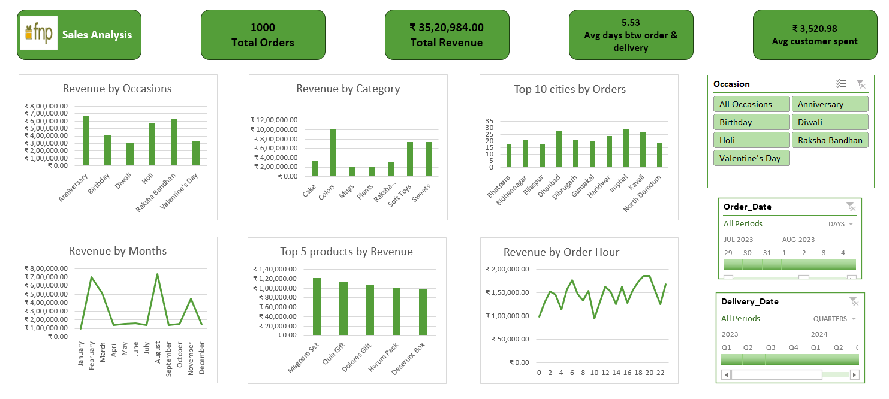

# 📊 Sales Analysis & Interactive Excel Dashboard

An end-to-end Sales Analysis project built using Microsoft Excel to transform raw sales data into an interactive business dashboard.

The project analyzes customer, product, order, revenue, and delivery information to identify sales trends, top-performing products, customer behavior, and other business insights.

📄 **License:** MIT | 🔗 **[View project post on LinkedIn](https://lnkd.in/p/dZyYtDXz)**

---

## 📑 Table of Contents

- [Project Objective](#-project-objective)
- [Dataset](#-dataset)
- [Data Preparation & ETL](#-data-preparation--etl)
- [Data Model](#️-data-model)
- [Analysis Performed](#-analysis-performed)
- [Key Performance Indicators (KPIs)](#-key-performance-indicators-kpis)
- [Interactive Dashboard](#-interactive-dashboard)
- [Dashboard Insights](#-dashboard-insights)
- [Tools & Technologies](#️-tools--technologies)
- [Setup & Usage](#-setup--usage)
- [Data Privacy Note](#-data-privacy-note)

---

## 🎯 Project Objective

The objective of this project is to analyze sales data and create an interactive Excel dashboard that helps answer key business questions such as:

- How much total revenue was generated?
- How many orders were placed?
- Which product categories generate the most revenue?
- Which products are the top revenue contributors?
- Which occasions generate the highest revenue?
- Which cities have the highest number of orders?
- How does revenue vary by month?
- At what hours are orders generating the most revenue?
- What is the average time between order and delivery?
- How much does the average customer spend?

---

## 📁 Dataset

The project uses three CSV files:

### 1. Customers.csv

Contains customer-related information such as:

- Customer ID
- Name
- City
- Contact Number
- Email
- Gender
- Address

### 2. Products.csv

Contains product information such as:

- Product ID
- Product Name
- Category
- Price (INR)
- Occasion

### 3. Orders.csv

Contains transaction and order-related information such as:

- Order ID
- Customer ID
- Product ID
- Quantity
- Order Date
- Order Time
- Delivery Date
- Delivery Time
- Location
- Occasion
- Price
- Revenue
- Order and delivery-related calculated fields

The datasets are connected using common identifiers such as Customer ID and Product ID.

---

## 🔄 Data Preparation & ETL

The raw CSV files were imported into Excel and prepared for analysis.

The data preparation process included:

- Importing CSV datasets
- Reviewing and correcting data types
- Cleaning and transforming columns
- Creating calculated columns
- Extracting month information from dates
- Extracting hour information from order time
- Calculating delivery-related metrics
- Creating revenue-related calculations
- Preparing datasets for analysis and visualization

---

## 🗂️ Data Model

The project uses a relational data model connecting the main datasets.

### Relationships

```text
Customers
    │
    │ Customer_ID
    ▼
Orders
    │
    │ Product_ID
    ▼
Products
```

### Main Tables

**Customers**
Contains customer information and demographic details.

**Orders**
Contains transaction-level information including orders, quantities, dates, delivery details, and revenue.

**Products**
Contains product information including category, price, and occasion.

This structure allows customer and product information to be analyzed together with transaction data.

---

## 📊 Analysis Performed

The project analyzes sales performance across multiple dimensions.

### Revenue Analysis
- Total revenue
- Revenue by occasion
- Revenue by product category
- Revenue by month
- Revenue by order hour

### Product Analysis
- Top 5 products by revenue
- Product category performance
- Product-level revenue contribution

### Customer & Location Analysis
- Order volume by city
- Top 10 cities by number of orders
- Customer spending analysis

### Order & Delivery Analysis
- Total number of orders
- Average customer spending
- Average days between order and delivery
- Order timing analysis

---

## 📈 Key Performance Indicators (KPIs)

The dashboard contains the following major KPIs:

| KPI | Description |
|---|---|
| Total Orders | Total number of orders |
| Total Revenue | Total revenue generated |
| Average Delivery Time | Average days between order and delivery |
| Average Customer Spend | Average revenue generated per customer |

---

## 📊 Interactive Dashboard

The Excel dashboard provides an interactive view of the sales data.




### Dashboard Components
- Revenue by Occasions
- Revenue by Category
- Top 10 Cities by Orders
- Revenue by Months
- Top 5 Products by Revenue
- Revenue by Order Hour
- Occasion Slicer
- Order Date Timeline
- Delivery Date Timeline

Users can interact with the dashboard using slicers and timelines to dynamically filter the analysis.

---

## 🔎 Dashboard Insights

The dashboard can be used to identify:

- High-performing product categories
- Top revenue-generating products
- High-performing occasions
- Cities with higher order volumes
- Monthly revenue trends
- Revenue patterns throughout the day
- Customer spending patterns
- Order-to-delivery performance

These insights can help businesses understand sales performance and identify areas for improvement.

---

## 🛠️ Tools & Technologies

- Microsoft Excel
- Power Query
- Power Pivot
- PivotTables
- PivotCharts
- Slicers
- Timelines
- Excel Data Model
- DAX
- CSV

---

## 🚀 Setup & Usage

1. Clone or download this repository.
2. Navigate to the `Excel/` folder and open the main `.xlsx` dashboard file.
3. If prompted, click **Enable Content** / **Enable Editing** so Power Query and Power Pivot connections can refresh.
4. To refresh the underlying data, go to **Data → Refresh All** (this reloads the CSVs from the `Data/` folder through Power Query).
5. Use the slicers and timelines on the dashboard sheet to filter by occasion, order date, or delivery date.

---

## 🔒 Data Privacy Note

> All customer data (names, contact numbers, emails, addresses) used in this project is **synthetically generated / anonymized sample data** created for demonstration and portfolio purposes only. It does not represent real individuals or actual business records.

---

## 📄 License

This project is licensed under the [MIT License](LICENSE).
